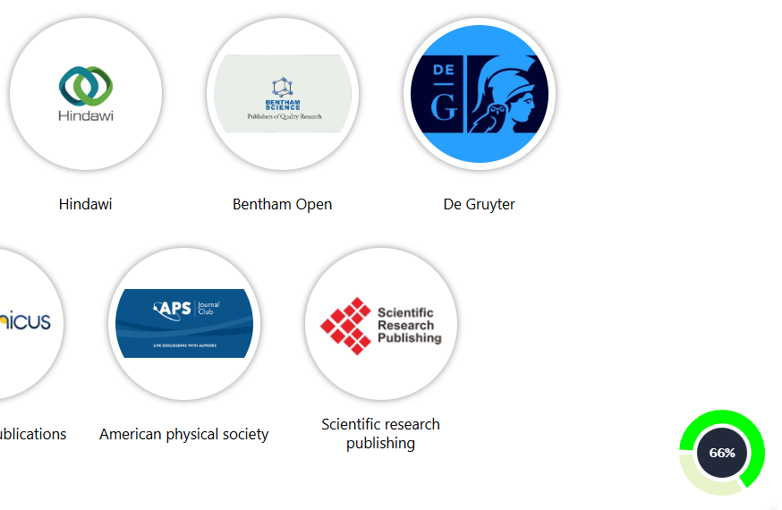

# react-scroll-progress-tracker

A small React component that shows page scroll progress in a compact doughnut tracker.

The tracker stays in the bottom-right corner and updates automatically as the user scrolls.

## Demo



## Install

```bash
npm install react-scroll-progress-tracker
```

The package expects the consuming app to provide matching `react` and `react-dom` versions. If your app already uses React 19, keep both packages on the same patch version.

## Use

```jsx
import { ScrollIndicator } from "react-scroll-progress-tracker";

export default function App() {
  return <ScrollIndicator />;
}
```

## Props example

```jsx
import { ScrollIndicator } from "react-scroll-progress-tracker";

export default function App() {
  return (
    <ScrollIndicator
      size={80}
      color="#0ea5e9"
      trackColor="rgba(148, 163, 184, 0.35)"
    />
  );
}
```

## Props

- `size`: number in pixels, default `96`
- `color`: any valid CSS color string, default `#00ff00`
- `trackColor`: any valid CSS color string for the inactive ring path

## Props explanation

- `size` controls how much space the tracker takes on the page.
- `color` controls the visible progress arc.
- `trackColor` controls the inactive ring, which helps the progress stand out clearly.

## Notes

- The component is fixed to the bottom-right corner.
- It tracks scroll position automatically.
- React is required as a peer dependency.

## Note

Make sure `react` and `react-dom` are installed at the same version in the consuming app.
